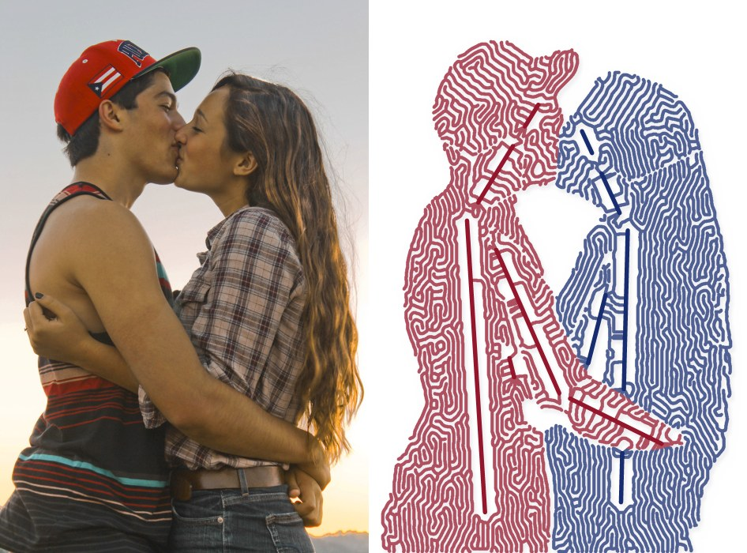
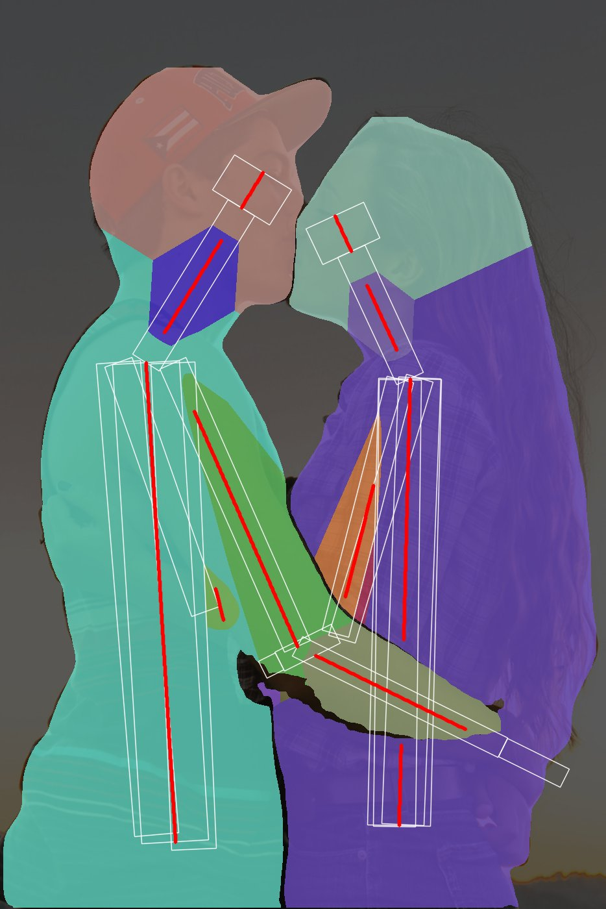
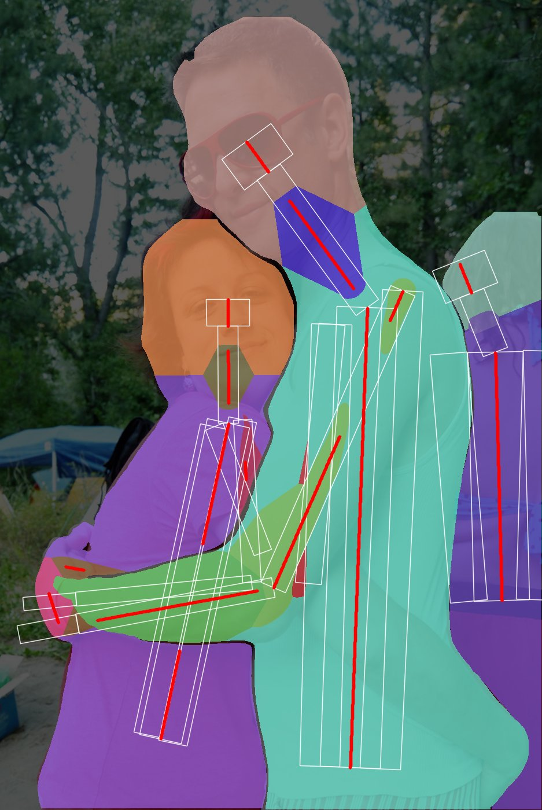
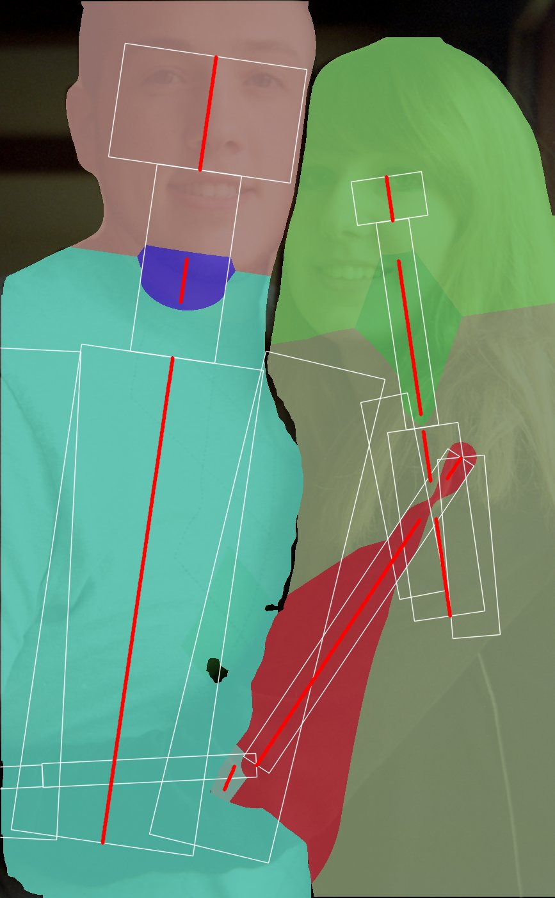

# xray-compose

Splices real X-ray, MRI and ultrasound images over a whole-body nuclear bone scan so each tile sits on its matching anatomy. Every tile keeps a hard rectangular border.


```sh
pip install idc-index pydicom pylibjpeg pylibjpeg-libjpeg pylibjpeg-openjpeg numpy pillow
make data   # download the source DICOMs and write data/*.png
make run    # build the C++ compositor and write out/composite.png
```

## How it works

- `tools/fetch.py` pulls specific series from the [NCI Imaging Data Commons](https://imaging.datacommons.cancer.gov/) through `idc-index`:
  - a whole-body bone scan
  - CR/DX films of the chest, shoulder, pelvis, lumbar spine, elbow, knee and femur
  - a coronal brain MRI
  - a liver ultrasound

  It also pulls a lower-leg CR film from [pydicom-data](https://github.com/pydicom/pydicom-data). Each image is normalised to an 8-bit PNG.
- `src/compose.cpp` (C++17, with the stb headers in `third_party/`) draws the inverted bone scan as the body. It then pins each tile by landmark: a point in the source image, such as the midpoint between the femoral heads, maps onto the same anatomy on the bone scan, with a given width and rotation.
- `layout.txt` sets the background and the tiles:

  ```
  bg   file invert gain gamma x y
  tile file  sx sy sw sh  ax ay  dx dy  width angle [border]
  ```

  - `s*`: crop, as fractions of the source image.
  - `a*`: source landmark, as fractions of the source image.
  - `d*` and `width`: target position and tile width, as percentages of the 512×1088 bone-scan space.
  - Tiles are drawn in file order.

## Credits

The IDC images come from TCIA collections CMB-PCA, CMB-MML, CMB-LCA and VAREPOP-APOLLO, licensed CC BY 4.0. The leg film is from pydicom-data.

---

# Embrace veins

Traces people hugging as floating veins on a white background. Each body is blocked out in 3D to find the centre line of every limb. A centre vein runs down that line, and a reaction-diffusion labyrinth of child veins branches off it to fill the form. Only the parts facing the camera are used.


| photo → veins | 3D blockout and visible parts |
|---|---|
|  |  |
|  |  |
|  |  |

```sh
pip install ultralytics opencv-python-headless numpy scipy scikit-image
make hugs    # download the photos and YOLO11 weights into data/
make veins   # write out/veins/<id>.png, <id>_pair.jpg and <id>_blockout.jpg
```

The labyrinth runs on the CPU and takes about 2 to 6 minutes per photo.

## How it works

`tools/veins.py`:

1. **People.** YOLO11 instance segmentation gives one mask per person. YOLO11 pose gives 17 keypoints per person, and each pose goes to the mask that holds most of its keypoints. Pose and segmentation both hold up far better on hugs than MediaPipe did.
2. **3D blockout.** Each person is built from capsules: head, neck, a torso made of three capsules side by side, upper arms, forearms, hands, thighs and shins. Radii are set from body proportions relative to the shoulder width. A part's depth comes from how confidently its joints were seen: YOLO reports occluded joints with low confidence, so those parts sit further back.
3. **Visible parts only.** The capsules are rasterised into a z-buffer inside each person's mask, and each pixel keeps only the frontmost part. Where the other person is in front, their mask wins. Hidden stretches of a limb, such as an arm wrapped behind a back, are never used. In the blockout images, white outlines show the capsules, colours show the visible part map, and red lines show the centre veins.
4. **Centre veins.** Each part's axis (its centre-of-mass line) is kept only where that part is visible. A visible piece the axis never crosses gets its principal axis instead.
5. **Child veins.** A Gray-Scott reaction-diffusion labyrinth (feed 0.029, kill 0.057) grows from the centre veins:
   - Thin walls between parts keep each form separate.
   - The body outline is a no-flux boundary, so it never starts stripes of its own.
   - Diffusion is stronger along each part's axis. This turns the stripes across the axis, so they branch sideways off the centre vein.
   - Short stubs along each centre vein start the branches off at right angles.
6. **Equal widths.** The labyrinth is thinned to single lines. The period it actually grew is measured as body area divided by total line length. Every line is redrawn at exactly half that period, so each child vein is as wide as the gap beside it. Centre veins are drawn 30% wider. Child veins that end beside a centre vein, plus short side branches alternating left and right, tie the labyrinth onto it.
7. **Drawing.** Each person gets their own colour. Centre veins are full strength and child veins slightly paler. A soft drop shadow makes the veins look like they float.

Options:
- `--period N` sets the labyrinth spacing in px at the 1400 px working size (default 18); veins are half this wide.
- `--aniso A` sets how strongly the branches turn across each limb (0 gives a plain labyrinth; default 0.4).
- `--debug` also writes the blockout image.

Limitations:
- The blockout is only as good as the pose. Where YOLO misses a limb, that area becomes one undivided form.
- In `e881775b897cafa8`, YOLO merges the two men into one mask and leaves out the front man's face.

## Credits

All photos are from the [Open Images](https://storage.googleapis.com/openimages/web/index.html) V7 validation set, tagged "Hug" by human raters, and licensed CC BY 2.0 on Flickr:
sharona and david by SharonaGott · Darryl Stephens and Peter Paige by Greg Hernandez · bf friendship by mat's eye · hug hug kiss kiss by llinddsayy · Untitled by monicasecas · Picture_343 by Patty · Brian and Me by LeAnn E. Crowe · Mom & Son by Gabriela Pinto. Links are in `tools/fetch_hugs.py`. The YOLO11 models are by Ultralytics (AGPL-3.0).
