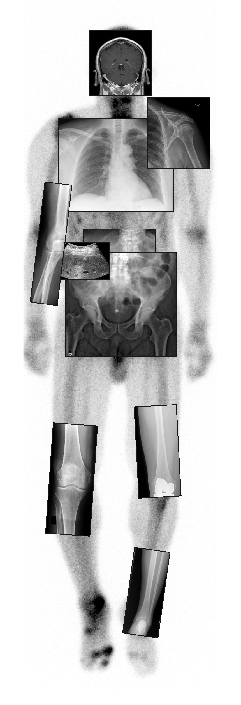
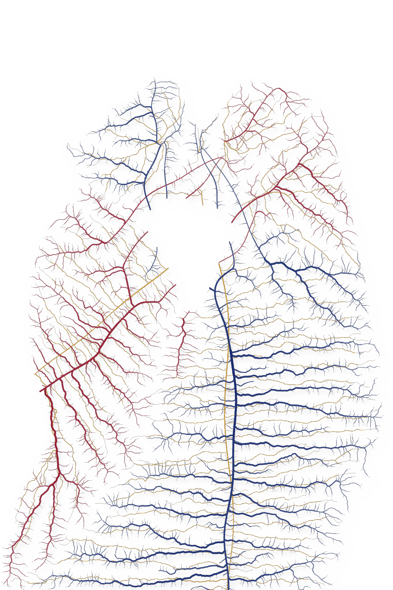
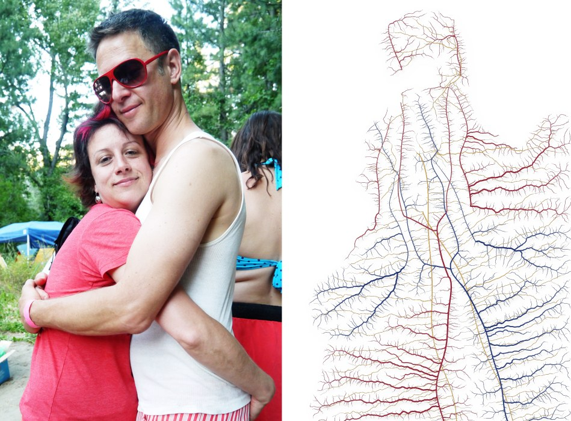
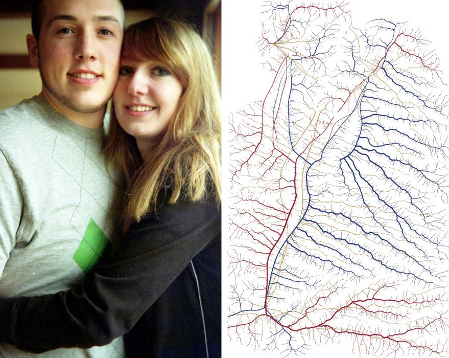
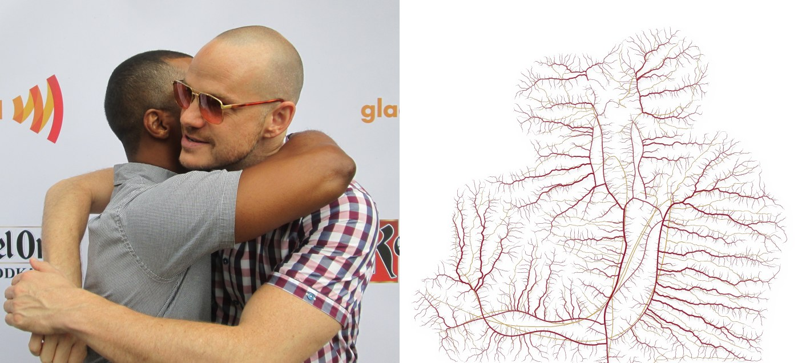
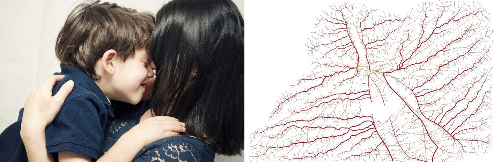

# xray-compose

Splices real X-ray, MRI and ultrasound images over a whole-body nuclear bone scan so each tile sits on its matching anatomy. Every tile keeps a hard rectangular border.



```sh
pip install idc-index pydicom pylibjpeg pylibjpeg-libjpeg pylibjpeg-openjpeg numpy pillow
make data   # download the source DICOMs and write data/*.png
make run    # build the C++ compositor and write out/composite.png
```

## How it works

- `tools/fetch.py` pulls specific series from the [NCI Imaging Data Commons](https://imaging.datacommons.cancer.gov/) through `idc-index`:
  - a whole-body bone scan
  - CR/DX films of the chest, shoulder, pelvis, lumbar spine, elbow, knee and femur
  - a coronal brain MRI
  - a liver ultrasound

  It also pulls a lower-leg CR film from [pydicom-data](https://github.com/pydicom/pydicom-data). Each image is normalised to an 8-bit PNG.
- `src/compose.cpp` (C++17, with the stb headers in `third_party/`) draws the inverted bone scan as the body. It then pins each tile by landmark: a point in the source image, such as the midpoint between the femoral heads, maps onto the same anatomy on the bone scan, with a given width and rotation.
- `layout.txt` sets the background and the tiles:

  ```
  bg   file invert gain gamma x y
  tile file  sx sy sw sh  ax ay  dx dy  width angle [border]
  ```

  - `s*`: crop, as fractions of the source image.
  - `a*`: source landmark, as fractions of the source image.
  - `d*` and `width`: target position and tile width, as percentages of the 512×1088 bone-scan space.
  - Tiles are drawn in file order.

## Credits

The IDC images come from TCIA collections CMB-PCA, CMB-MML, CMB-LCA and VAREPOP-APOLLO, licensed CC BY 4.0. The leg film is from pydicom-data.

---

# Embrace veins

Traces people hugging as floating veins and nerves on a white background.



| | |
|---|---|
|  |  |
|  |  |

```sh
pip install mediapipe opencv-python-headless numpy scipy
make hugs    # download the photos and MediaPipe models into data/
make veins   # write out/veins/<id>.png and <id>_pair.jpg
```

On a bare Linux box MediaPipe also needs `libegl1` and `libgles2`.

## How it works

`tools/veins.py`:

1. **Silhouette.** MediaPipe's multiclass selfie segmenter masks each person's hair, skin and clothes.
2. **People.** Each face the BlazeFace detector finds counts as one person. The pose landmarker often merges two hugging bodies into one skeleton, so a pose is used only when its nose falls on a detected face and its shoulders fit that face's size. Any other face gets a head-and-shoulders pose estimated from its eyes, mouth and ears.
3. **Named vessels.** The landmarks set the paths of the main veins: superior and inferior vena cava, internal and external jugular, subclavian and axillary, cephalic, basilic, median cubital, iliac, femoral, great and small saphenous, facial and superficial temporal. They also set the main nerves: spinal cord, median, ulnar, radial, sciatic, femoral, tibial and facial. Each path is bent slightly with low-frequency noise so it doesn't look ruler-drawn.
4. **Branching.** Space colonisation grows from those trunks in two passes, constrained to the silhouette. A coarse pass lays long tributaries and a fine pass fills in the twigs. Extra attractors along the outline make the edge of the body readable. Nerves grow as a sparser web.
5. **Width.** Each segment's width follows Murray's law, scaling with the number of branch tips it drains.
6. **Drawing.** Each person's veins get their own colour, so you can see where the two networks meet. Nerves are gold. Lines are drawn at 3× supersampling with a soft drop shadow, so they appear to float.

`--seed N` gives a different growth and `--no-nerves` draws the veins only. To use other photos, pass their paths: `python3 tools/veins.py my.jpg`.

## Credits

All photos are from the [Open Images](https://storage.googleapis.com/openimages/web/index.html) V7 validation set, tagged "Hug" by human raters, and licensed CC BY 2.0 on Flickr:
sharona and david by SharonaGott · Darryl Stephens and Peter Paige by Greg Hernandez · bf friendship by mat's eye · hug hug kiss kiss by llinddsayy · Untitled by monicasecas · Picture_343 by Patty · Brian and Me by LeAnn E. Crowe · Mom & Son by Gabriela Pinto. Links are in `tools/fetch_hugs.py`.
